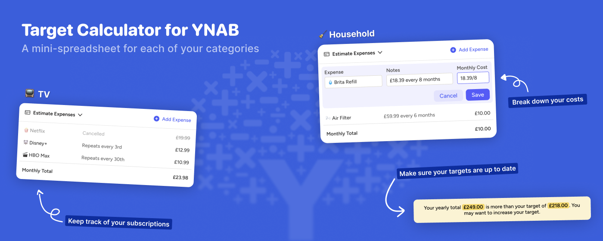
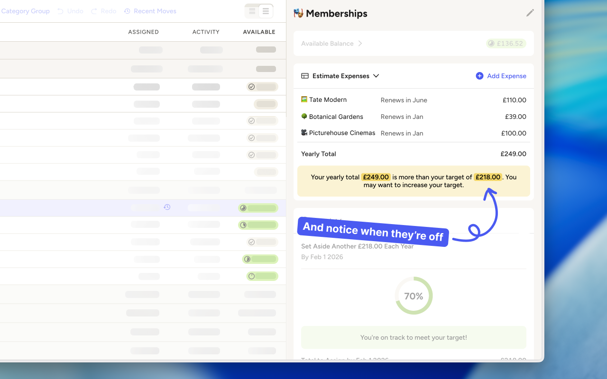

# YNAB Expense Calculator (ynab-target-calculator)

YNAB Expense Calculator adds a flexible mini‑spreadsheet directly into your category sidebar, so you can keep track of the math behind each target.

Instead of creating dozens of separate categories or doing the math in Notes or a separate spreadsheet, you get a small, purpose‑built calculator that lives right where you budget.

---

## Why this exists

Budgeting in YNAB often means:

- Remembering which recurring expenses live in a category
- Re‑doing the same mental math every month
- Forgetting how you arrived at a target in the first place

This extension gives you a small calculator embedded in the sidebar for each category, so you can:

- Keep track of recurring expenses in a category  
- Instantly add up regular expenses to decide what your target should be  
- Create a record of when and how you came to the budgeted amount  
- Quickly tell if you need to adjust your target  

Think of it as notes, but better.

---

## Features

- **Mini spreadsheet in the category sidebar**  
  Add individual line items for all the recurring expenses that roll into a category.

- **Support for different currencies**  
  Works with whatever currency your YNAB budget uses.

- **Monthly and yearly targets**  
  See how much you should set aside monthly or annually for a group of expenses.

- **Target vs. reality alerts**  
  Get a subtle alert when your estimated expenses exceed your current target, so you know to revisit the number.

- **Memos for each expense**  
  Add a small note (like payment date, service name, or billing cycle) to each line.

- **Exclude / pause expenses**  
  Temporarily exclude an item from the total when a subscription is paused, without losing the line for later.

---

## How it works

1. Open your YNAB budget in the browser.
2. Click a category in the sidebar.
3. Use the mini‑spreadsheet to:
   - Add each recurring expense as a separate line
   - Give it a memo (e.g. *“Spotify – 25th each month”*)
   - Mark whether it should be included in the total
4. Use the calculated total to set (or adjust) your category’s target.

Over time, the calculator becomes a living log of how you structure that category, instead of a number you have to remember or re‑infer.

---

## Installation

1. Download or clone the **ynab-target-calculator** folder.
2. In Chrome, go to `chrome://extensions`.
3. Enable **Developer mode**.
4. Click **Load unpacked** and select the downloaded **ynab-target-calculator** folder.
5. Open YNAB and start budgeting with the calculator in your category sidebar.

---

## Feedback

If you spot a bug, have an idea for an improvement, or want support for a different budgeting pattern, please open an issue in this repository.
